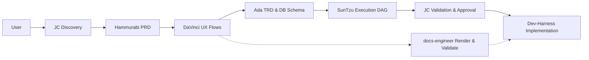
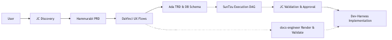

# Oh My PM Architecture

Oh My PM is a project-level Product Management harness that installs agent instructions and a manifest contract.

## Components

| Component | Responsibility |
| --- | --- |
| CLI | Installs templates, initializes `.pm/`, validates manifests. |
| OpenCode runtime plugin | Registers five PM agents through OpenCode `config.agent`. |
| OpenCode templates | `SKILL.md` files for project-level routing and memory. |
| Claude template | `CLAUDE.md` instructions for Task-based delegation. |
| OpenAI template | `agents.py` with Agents SDK definitions and handoffs. |
| Generic template | Portable Markdown instructions for any LLM. |
| Manifest schema | Contract shape for Oh My PM and Dev-Harness. |

## Pipeline

## Delegation model

JC delegates by lane. Each specialist receives complete context and returns an artifact plus validation evidence. JC never performs specialist work unless the specialist lane is unavailable, and it records that exception as a decision.

## Contract model

`.pm/pm_manifest.json` is the only cross-system contract. It references all blueprints and stores DAG tasks, decisions, and blockers.

## Verification model

Every stage has gates:

- Artifact exists.
- Artifact-specific validation passes.
- Manifest references are consistent.
- Blockers are open when ambiguity remains.
- Approval is explicit before development starts.

## Runtime plugin model

`src/index.ts` exports the OpenCode plugin. The plugin loads `oh-my-pm.json` from the project root or `~/.config/opencode/`, resolves the active preset, then returns a config hook that merges JC, Hammurabi, DaVinci, Ada, and SunTzu into `opencodeConfig.agent`. The CLI entry point lives in `src/cli.ts` and is exposed as the `oh-my-pm` binary.

## Configuration parity with oh-my-opencode-slim

Oh My PM follows the same installation shape: `opencode.jsonc` registers the npm plugin, `oh-my-pm.json` stores plugin-specific presets, and `skills/oh-my-pm/SKILL.md` documents safe configuration changes. The domain differs: this package specializes in Software Product Management rather than general coding orchestration.
