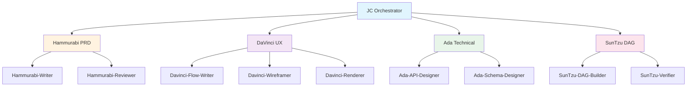
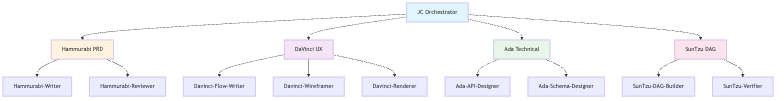

# Sub-Agent Architecture Plan





## Problem

Each PM agent (JC, Hammurabi, DaVinci, Ada, SunTzu) currently handles all
levels of work — from strategic judgment to mechanical writing. This is
inefficient because:

- Expensive models handle trivial tasks (schema formatting, manifest updates)
- No parallelization within an agent's workflow
- No separation of concerns between "what to do" and "how to do it"
- Hard to audit or review work at different granularity levels

## Solution: Hierarchical Sub-Agent Delegation

Each main agent becomes an **orchestrator + reviewer** for its lane.
Sub-agents handle bounded mechanical tasks with cheaper models.

### Design Principles

1. **Main agent owns the lane** — strategy, judgment, integration, review
2. **Sub-agents execute bounded tasks** — one job, one output, one file
3. **Sub-agents use cheaper models** — 50-70% cost reduction per call
4. **Sub-agents can have helpers** — recursive delegation for complex flows
5. **Output contract** — sub-agents write to `_workspace/{agent}/artifacts/` or the target doc path
6. **Parent reviews before integrating** — no blind trust

### Cost Model

| Level | Model Tier | Cost/Call | Best for |
|-------|-----------|-----------|----------|
| Main agent | Premium (gpt-5.5, big-pickle) | $$$ | Strategy, review, integration |
| Sub-agent | Mid (gpt-4.1, deepseek-v4-flash) | $$ | Structured writing, formatting |
| Helper | Cheap (mimo-v2.5-free, mini) | $ | Mechanical tasks, regex, grep |

## Proposed Agent Hierarchy

### JC (Product Orchestrator)

```
JC (main)
├── jc-scout          — lightweight discovery, reads drafts, suggests gaps
│   └── (cheap model, read-only)
├── jc-validator      — validates manifest JSON, cross-refs, lifecycle
│   └── (cheap model, read-only)
└── jc-integrator     — consolidates specialist outputs into manifest
    └── (mid model, writes manifest)
```

**Workflow:**
```
User input → JC analyzes scope
  → jc-scout checks existing artifacts
  → JC delegates to Hammurabi/DaVinci/Ada/SunTzu
  → Specialists return artifacts
  → jc-integrator updates manifest
  → jc-validator validates manifest
  → JC presents for approval
```

### Hammurabi (PRD Specialist)

```
Hammurabi (main)
├── hammurabi-writer          — writes PRD sections from structured input
│   └── (mid model, writes docs/prd.md)
├── hammurabi-reviewer        — checks PRD completeness, acceptance criteria
│   └── (cheap model, read-only)
└── hammurabi-stories         — breaks requirements into user stories
    └── (mid model, appends to PRD)
```

**Workflow:**
```
JC delegates PRD work
  → Hammurabi analyzes requirements
  → hammurabi-writer drafts each section
  → hammurabi-stories creates user stories
  → hammurabi-reviewer validates
  → Hammurabi reviews and integrates
  → Returns PRD to JC
```

### DaVinci (UX/UI Specialist)

```
DaVinci (main)
├── davinci-flow-writer       — writes Mermaid diagrams from journey text
│   └── (mid model, writes docs/flows/*.md)
├── davinci-wireframer        — generates wireframe markdown for screens
│   └── (mid model + image-gen, writes docs/ux/screens/*.md)
├── davinci-arch-diagrammer   — writes architecture diagrams
│   └── (mid model, writes docs/architecture/*.md)
├── davinci-decision-writer   — writes ADRs with decision graphs
│   └── (mid model, writes docs/decisions/*.md)
└── davinci-renderer          — runs render-mermaid.mjs, validates outputs
    └── (cheap model, runs script, checks images)
```

**Workflow:**
```
JC delegates UX/architecture work
  → DaVinci plans what diagrams are needed
  → Parallel: davinci-flow-writer, davinci-wireframer, davinci-arch-diagrammer
  → davinci-decision-writer documents decisions
  → davinci-renderer renders all diagrams to PNG
  → DaVinci reviews and resolves cross-references
  → Returns artifacts to JC
```

### Ada (Technical Design Specialist)

```
Ada (main)
├── ada-api-designer          — drafts API endpoints from TRD requirements
│   └── (mid model, writes TRD sections)
├── ada-schema-designer       — drafts database schemas from domain model
│   └── (mid model, writes docs/db-schema.md)
├── ada-security-reviewer     — checks for security gaps in design
│   └── (cheap model, read-only checklist)
└── ada-constraint-doc        — documents constraints and integration points
    └── (mid model, appends to TRD)
```

**Workflow:**
```
JC delegates TRD work
  → Ada analyzes PRD + UX flows
  → Parallel: ada-api-designer, ada-schema-designer
  → ada-constraint-doc documents non-functional requirements
  → ada-security-reviewer checks for gaps
  → Ada integrates, reviews, resolves conflicts
  → Returns TRD + schema to JC
```

### SunTzu (Execution Strategist)

```
SunTzu (main)
├── suntzu-dag-builder        — builds execution_dag from plans
│   └── (mid model, writes manifest DAG)
├── suntzu-verifier           — writes verification criteria per task
│   └── (mid model, updates manifest tasks)
└── suntzu-blocker-analyst    — analyzes blockers and suggests resolutions
    └── (cheap model, read-only analysis)
```

**Workflow:**
```
JC delegates execution planning
  → SunTzu reads PRD, TRD, UX flows
  → suntzu-dag-builder creates task DAG
  → suntzu-verifier attaches verification criteria
  → SunTzu reviews dependencies and ordering
  → Returns execution plan to JC
```

## Implementation Phases

### Phase 1 — Foundation (Next Release)
- Add `jc-validator` as first sub-agent (validates `pm_manifest.json`)
- Add `davinci-renderer` as first sub-agent (runs `render-mermaid.mjs`)
- Add sub-agent support infrastructure:
  - `PM_SUB_AGENT_NAMES` registry in `agents.ts`
  - `PM_SUB_AGENT_CONFIGS` with prompts and tool sets
  - `mergePMSubAgents()` similar to `mergePMAgents()`
- Update plugin hook to inject sub-agents alongside main agents

### Phase 2 — Core Sub-Agents
- `hammurabi-writer`, `hammurabi-reviewer`
- `davinci-flow-writer`, `davinci-wireframer`
- `ada-api-designer`, `ada-schema-designer`
- `suntzu-dag-builder`, `suntzu-verifier`

### Phase 3 — Recursive Delegation
- Allow sub-agents to have their own helpers (e.g., `davinci-renderer` calls `helper-image-optimizer`)
- Add cost-tracking overlay to measure savings

### Phase 4 — Autonomous Mode
- Sub-agents queue work without waiting for parent review
- Parent does batch review at end of phase
- Self-healing: failed sub-agent tasks auto-retry with cheaper model

## Key Decisions

| Decision | Choice | Rationale |
|----------|--------|-----------|
| Sub-agent naming | `{parent}-{role}` | Clear hierarchy, easy routing |
| Sub-agent storage | Same file as parent agents (`agents.ts`) | Co-located, easy to maintain |
| Sub-agent model | Preset-based via `oh-my-pm.json` | Same preset system as main agents |
| Sub-agent prompt | Hardcoded in plugin (like main agents) | Consistent, version-controlled |
| Sub-agent tools | Read-only for validators, writable for writers | Least privilege |
| Output contract | Write to target doc path or `_workspace/{agent}/artifacts/` | Parent picks up from known paths |

## Open Questions

1. **Should sub-agents register as OpenCode agents or be purely internal?**
   - Internal: managed entirely by the parent via `task()` calls
   - External: registered as OpenCode agents accessible by name
   - Recommendation: Internal at first (Phase 1-2), externalize in Phase 3

2. **How to handle sub-agent failures?**
   - Retry with same model (1x)
   - Escalate to parent with error details
   - Parent decides to retry with better model or fix manually

3. **Model selection for each preset?**
   - Each preset needs sub-agent model overrides
   - Sub-agents should default to a cheaper variant of the parent's provider
